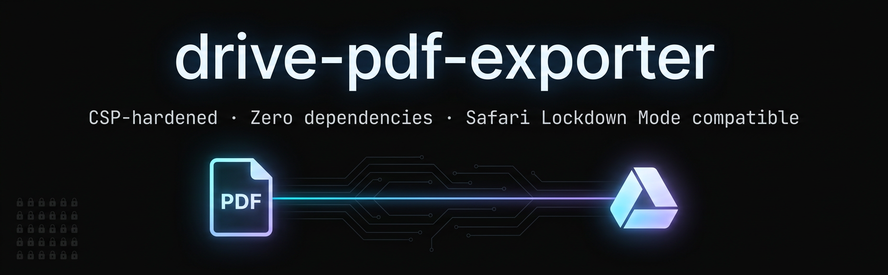

# drive-pdf-exporter

Export any Google Drive document to a PDF directly from your browser console — no extensions, no backend, no credentials. Works in Chrome and Safari, including **Safari Lockdown Mode**.

---

## Why This Exists

Google Drive's viewer lazy-renders pages as images in the DOM. There is no native "export to PDF" option that preserves layout for all document types. Every conventional approach — script injection, `eval()`, Workers, dynamic `import()` of ES modules — is blocked by Drive's strict `require-trusted-types-for 'script'` CSP policy.

This script works around every layer of that policy using only APIs that are not monitored by Trusted Types.

---

## How It Works

| Blocked by Drive CSP | This script instead |
|---|---|
| `<script src="...">` injection | Never creates a script tag |
| `eval()` / `(0,eval)()` | Never evaluates strings as code |
| `new Worker(blobUrl)` | Never spawns a Worker |
| `import()` of ES module builds | Fetches UMD build as **text**, wraps in a synthetic module blob, exports via `globalThis` |
| External `@babel/runtime` bare specifiers | Uses the self-contained UMD build only |

jsPDF's UMD build is fetched as a plain text string, wrapped in an ES module that stubs `window`/`self` to `globalThis`, and loaded via `import(blob:...)`. The resulting `jsPDF` constructor is used entirely in main-thread memory. No DOM sinks are touched after page capture. JPEG bytes are embedded directly into the PDF binary via the native `/DCTDecode` filter — no re-encoding.

---

## Usage

1. Open the Google Drive document in your browser
2. **Scroll through every page** so Drive lazy-loads all page images into the DOM
3. Open DevTools console (`⌥⌘J` Chrome · `⌥⌘C` Safari)
4. Paste and run [`export.js`](./export.js)
5. `document.pdf` downloads automatically

---

## Compatibility

| Environment | Status |
|---|---|
| Chrome (latest) | ✅ |
| Safari (latest) | ✅ |
| Safari Lockdown Mode | ✅ |
| Firefox | Untested |
| Mobile browsers | Untested |

> **Safari Lockdown Mode** disables most dynamic script execution vectors. This script was specifically developed and validated under Lockdown Mode constraints — the `import(blobUrl)` + UMD wrapper approach is the only known method that clears all three of its restrictions simultaneously: no script tag, no eval, no Worker with external source.

---

## Limitations

- **Scroll first.** Drive only renders page images when they scroll into view. Any page not yet rendered will be absent from the PDF.
- Image quality is determined by Drive's own rendered resolution, not the source document's native resolution.
- Very long documents (50+ pages) may cause the tab to slow during canvas capture — this is normal.
- Tested on Drive document viewer only. Slides and Sheets render differently and are untested.

---

## Fallback

If `import()` is blocked in a future CSP update, a fully dependency-free fallback is included in [`export.fallback.js`](./export.fallback.js). It hand-writes a spec-compliant PDF binary using only `Uint8Array`, `TextEncoder`, `canvas`, and `fetch(dataUrl)` — zero external requests, zero DOM sinks.

---

## License

GNU AGPL 3.0
